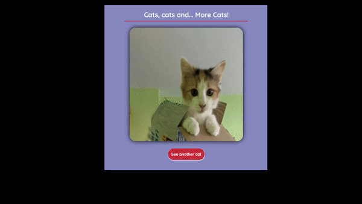
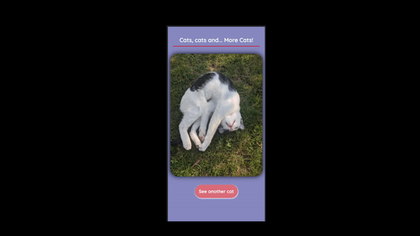

### JavaScript Assíncrono
*Atividade prática do curso de JavaScript Assíncrono ministrado pela [Stephany Nusch](https://www.linkedin.com/in/stephanynusch/).*

#### Consumindo a API dos gatos

- API: `https://thatcopy.pw/catapi/rest/`
- Método: `fetch()`

 

#### Aprendizados

- Promises
- Async e await
- Try Catch
- APIs (Application Programming Interface)
- JSON (JavaScript Object Notation)
- Fetch

 

#### Demonstração

[Acesse aqui!](https://ja-lourenco.github.io/asyncJS/)

 

#### Referência

[Autora: Stephany Nusch](https://github.com/stebsnusch)

[Repositório Original: Stephany Nusch](https://github.com/stebsnusch/basecamp-javascript/tree/main/javascript-assincrono)

 

#### Licença

[Veja sobre a licença](https://github.com/stebsnusch/basecamp-javascript/blob/main/javascript-assincrono/LICENSE)

 

#### Curso

[Web Developer Bootcamp - Digital Innovation One](https://www.dio.me)

 

#### 🖥️ Desktop

#### 📱 Mobile

